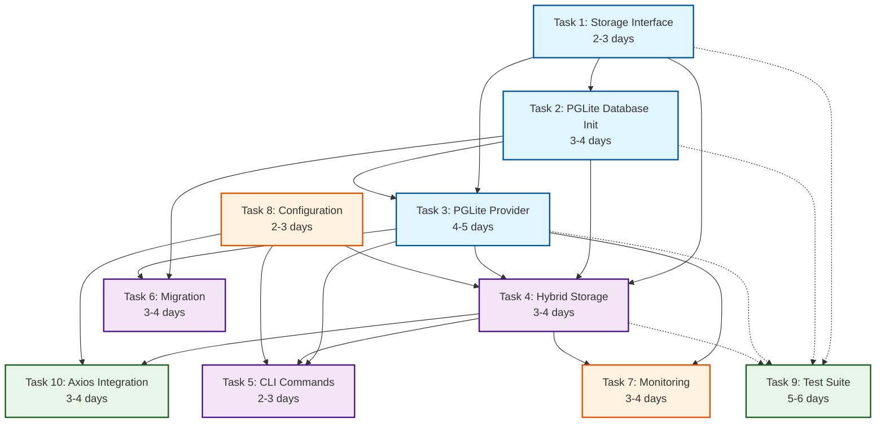

# Task Dependencies Visualization

## Dependency Graph



## Development Tracks

### Track A: Foundation (Can start immediately)
- **Developer 1**: Task 1 → Task 3 → Task 4
- **Developer 2**: Task 2 → Task 6 → Task 5
- **Developer 3**: Task 9 (Continuous)

### Track B: Features (Starts after foundation)
- **Developer 1**: Task 7 (Monitoring)
- **Developer 2**: Task 8 (Configuration)
- **Developer 3**: Task 10 (Integration)

## Critical Path
The critical path (longest dependency chain) is:
```
Task 1 → Task 2 → Task 3 → Task 4 → Task 10
Total: 15-19 days
```

## Parallelization Opportunities

### Week 1
- Task 1, 2, 9 can start immediately
- 3 developers working in parallel

### Week 2
- Task 3 begins (depends on 1 & 2)
- Task 6 can start (depends on 2)
- Task 8 can start independently

### Week 3
- Task 4 begins (depends on 1, 2, 3)
- Task 7 can start (depends on 3)
- Task 5 preparation

### Week 4
- Task 5 begins (depends on 3, 4)
- Task 10 begins (depends on 4, 8)
- Final integration and testing

## Risk Points

1. **Task 3 (PGLite Provider)**: Longest individual task, blocks many others
2. **Task 4 (Hybrid Storage)**: Central component, many dependencies
3. **Task 10 (Axios Integration)**: Final integration, discovers issues

## Mitigation Strategies

1. **Early Prototyping**: Start Task 3 prototypes during Task 1
2. **Interface Mocking**: Mock Task 1 interfaces for parallel development
3. **Continuous Testing**: Task 9 developer provides test infrastructure early
4. **Daily Syncs**: Coordinate interface changes between parallel tracks